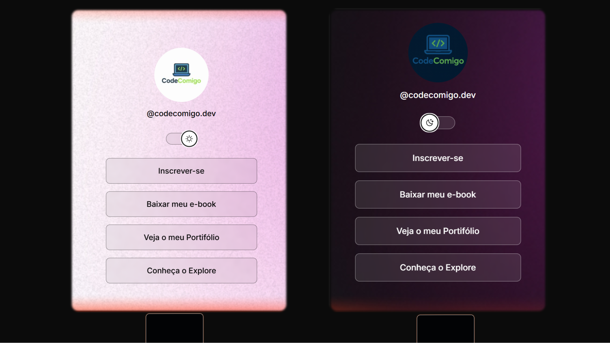

<h1 align="center"> Landing Page de Links </h1>

Uma página de links simples e direta que reúne, em um só lugar, vários botões com acessos importantes — como redes sociais, portfólio, contato e projetos. Foi realizado com o curso gratuito da Rocketseat.
  
<a href="https://app.rocketseat.com.br/journey/discover/contents">Estude esse projeto em formato de vídeo clicando aqui.</a>

 

  

 
## 🚀 Tecnologias

Esse projeto foi desenvolvido com as seguintes tecnologias:

- HTML e CSS
- JavaScript
- Git e Github
- Figma

## 💻 Projeto

O DevLinks é um agregador de links para usar como cartão de visitas online.

- [Acesse o projeto finalizado, online](https://maykbrito.github.io/devlinks)

- [Assistir aulas](https://lp.rocketseat.com.br/devlinks/inscricao?utm_source=github&utm_medium=descricao&utm_campaign=capture-devlinks&utm_term=organic&utm_content=descricao-github-mayk-brito)
